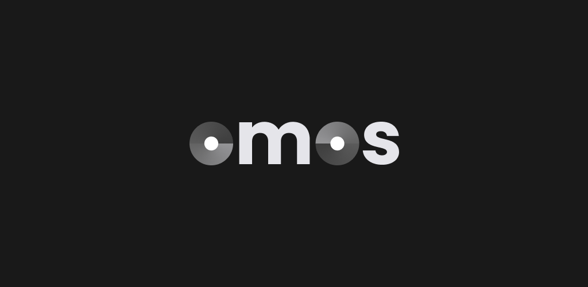
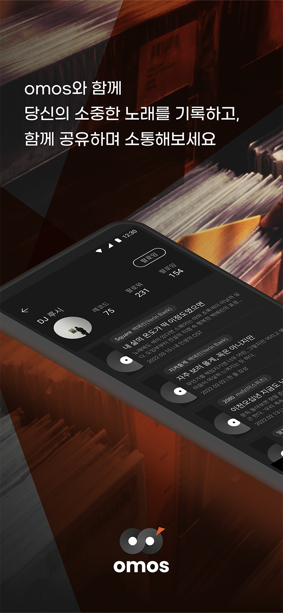
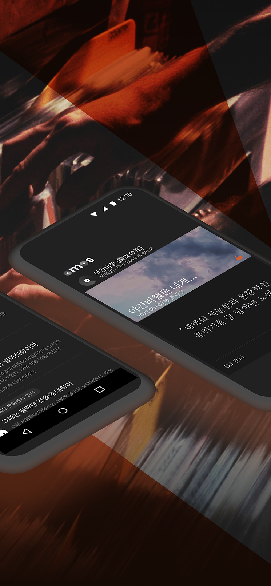
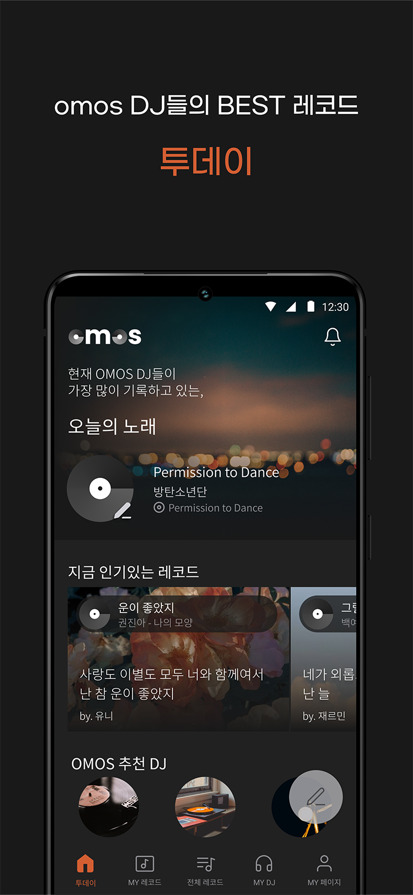
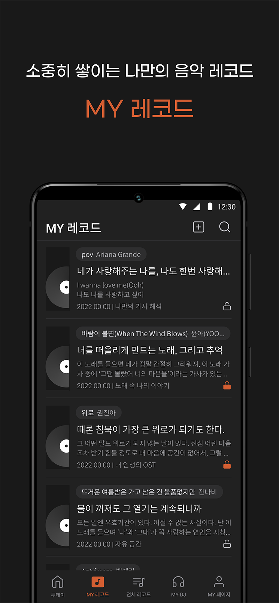
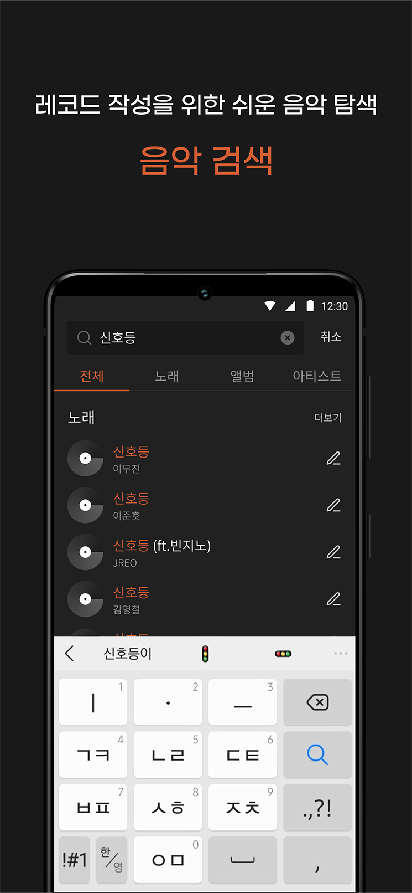
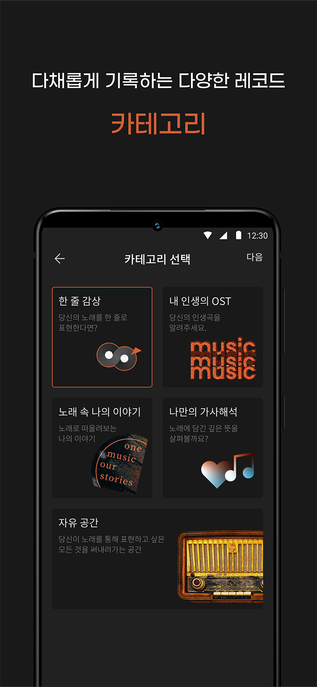
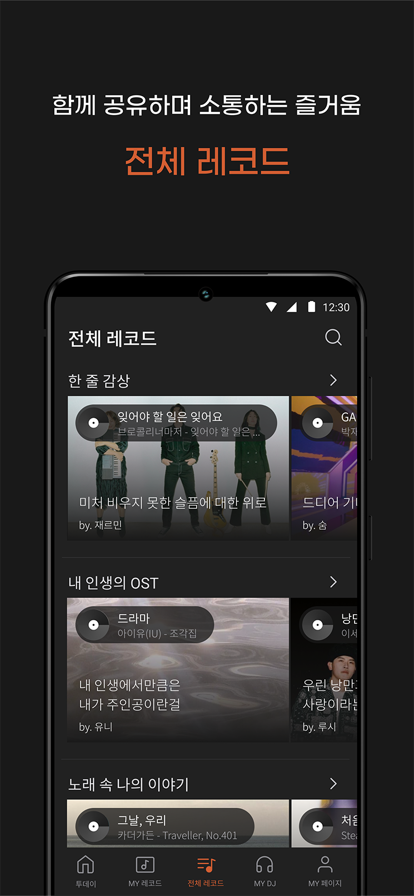

#  omos
**음악 감상 아카이빙 & 공유앱**
> 🏆 Central MakeUs Challenge 9th **대상**  
> 기간 : 2022.01 ~ 2022.05  
> 인원 : 5명  
> [Google PlayStore](https://play.google.com/store/apps/details?id=com.infinity.omos)

## Screenshots
    
   

## Features
- Kotlin
- MVVM Pattern
- Minimum SDK level 21
- Retrofit2 - HTTP Client
- OkHttp - Network interceptor
- Glide - Loading images
- Gson - Json library
- Jetpack
  - LiveData
  - ViewModel
  - Databinding
- Kakao SDK - User login
- AWS S3 SDK - Upload images

## CI/CD
- Github Actions
- InAppUpdate
